<h1 align="center">
   
  SE Lab
   
  <small>Assignment 1: Static Website</small>
</h1>

  <b>Group 5</b>
   
  Pouria Mahmoudkhan (401110289)
   
  Yasna Noushiravani (401106674)

---

  <a href="#overview">Overview</a> •
  <a href="#branches">Branches</a> •
  <a href="#conflicts">Conflicts</a> •
  <a href="#main-branch-protection">Main Branch Protection</a> •
  <a href="#github-pages-deployment">Github Pages Deployment</a> •
  <a href="#kanban-board-and-project-progress">Kanban Board and Project Progress</a>

## Overview
In this assignment we practiced essential skills needed to develop a project, including
1. Basic github commands
1. Merging branches
1. Resolving conflicts
1. Creating pull requests and reviewing them
1. Using github actions to automate Github Page deployment
1. Protecting a branch by only allowing changes via pull requests
1. Creating projects and kanban boards to record and manage progress

## Branches
This repository has 8 branches.
### Main branch
This is the main branch of our repository!

The final changes are merged into this branch. Therefore it is protected from unreviewed merges and pull requests are required to make changes to this branch.
### Feature branches
1. Index: This branch is related to the developement of the main page and was created quite early in the process. As the commits suggest, the files added to the project at this stage were
    - `index.html`: the HTML file for the landing page
    - `style.html`: the CSS file containing all of the styling used in the project
    - `images`: the folder containing the pictures used in the website

    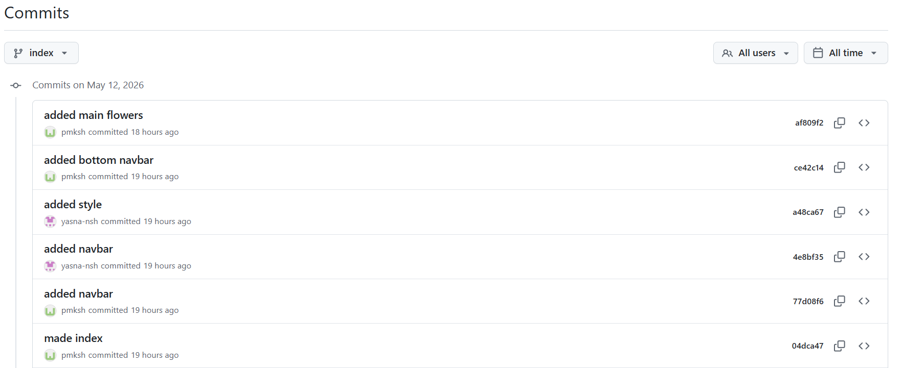
    After completing the developement of the main page, we merged this branch back into main using pull requests.
    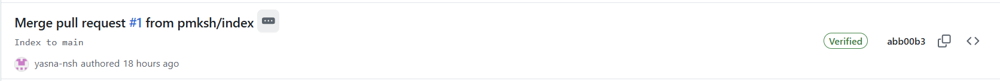

1. Review: In this branch we built the review tab. The changed files are
    - `review.html`: the HTML file for the review page, containing navbars and some reviews
    - `style.css`: this file was modified to contain the styles used by the review page

    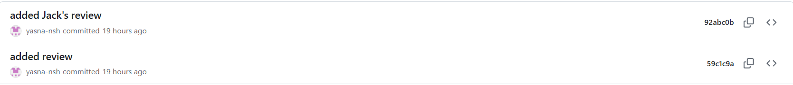
    This branch was developed in parallel with the roger branch.

1. Roger: This branch was used to make the Roger tab, containing
    - `roger.html`: the HTML file for the roger page
    - `style.css`: changes to the styles needed in this page
    - some images used in this page uploaded to the `images` folder

    The main branch was later merged into this branch to resolve the conflicts in `style.css`.
    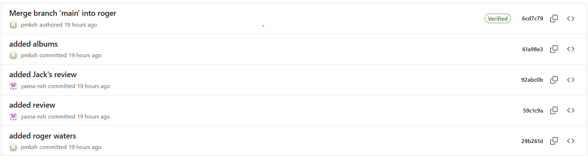
    Then a pull request was created to merge roger into main.
    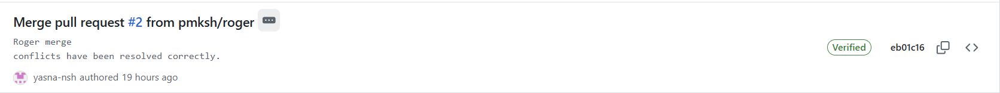

1. About-dev: The about section was added in this branch. Similar to the previous branches, `about.html` (the HTML file for this section) was created and `style.css` was modified.
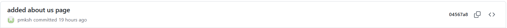

### Hotfix Branch
This branch was created to fix the unresponsiveness of the webpage. Then it was merged into main with a pull request.
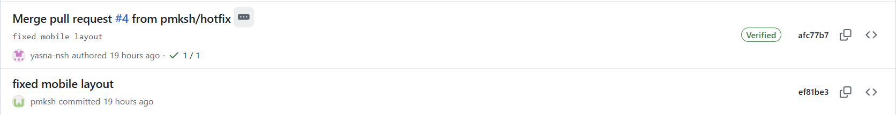

### pmksh-patch-1
In this branch the yaml file, required for Github Pages deployment with Github Actions, was created.
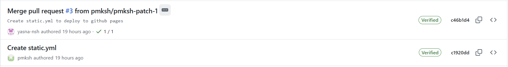

### Report Branch
Currently under development! This branch was created to add `.gitignore` and complete `README.md`. The changes currently commited to this branch are as follows.
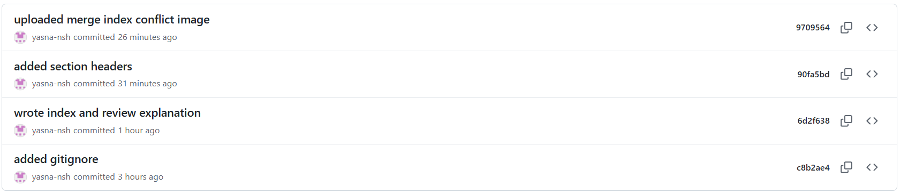
## Conflicts

1. The first conflict occured while merging the index branch. The class field in the navbar wa not present in one side of the conflict and the order of the links were different. The conflict was resolved in favor of the commit where the class field was present.
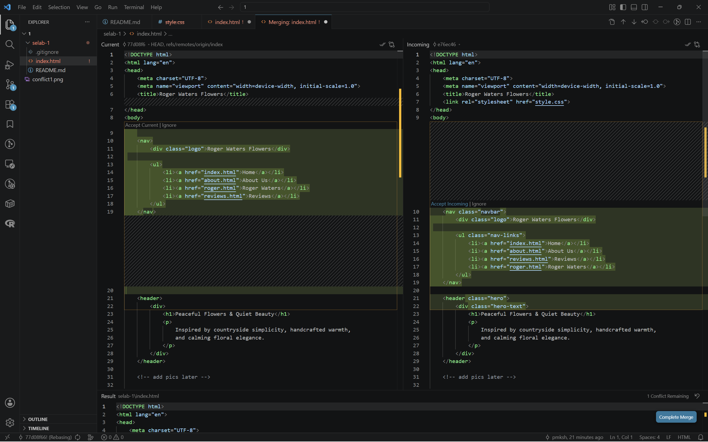
as can be seen in the picture above.

2. The second conflict occured while merging the roger branch. We both had changed the css file in parallel. The conflict was resolved by accepting both changes. This resolution was done in github.
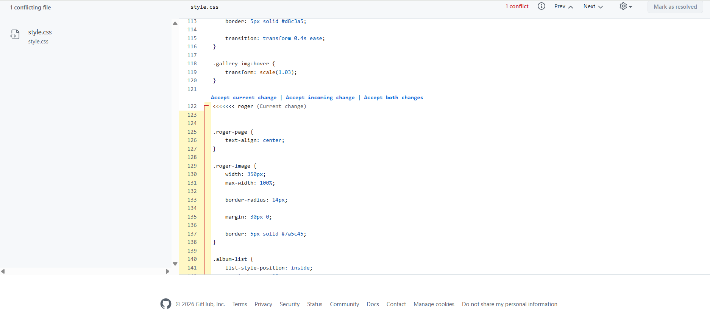
as can be seen in the picture above.

## Main Branch Protection

For this requirement we have set the rule to require a pull request before merging along with at least 1 approval from an admin.
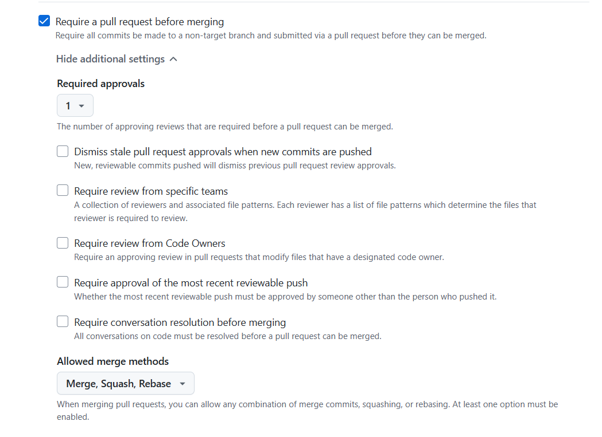

The review of the pull request can be seen in the picture below. This was during the index merge with main.

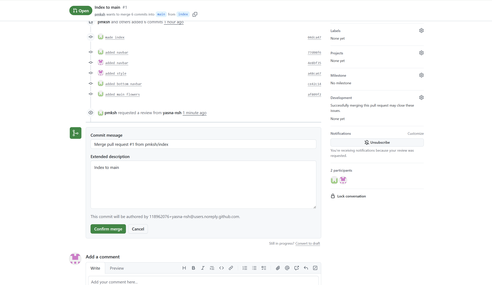

## Github Pages Deployment

Github pages was also created and deployed in github actions in the following url:
https://pmksh.github.io/selab-1/

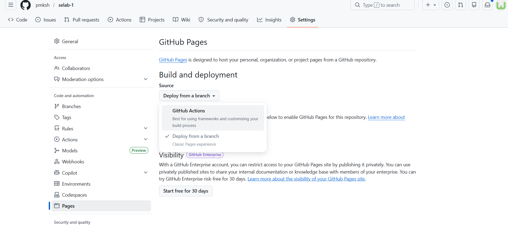
Made using the static html option, it was merged into main after review.
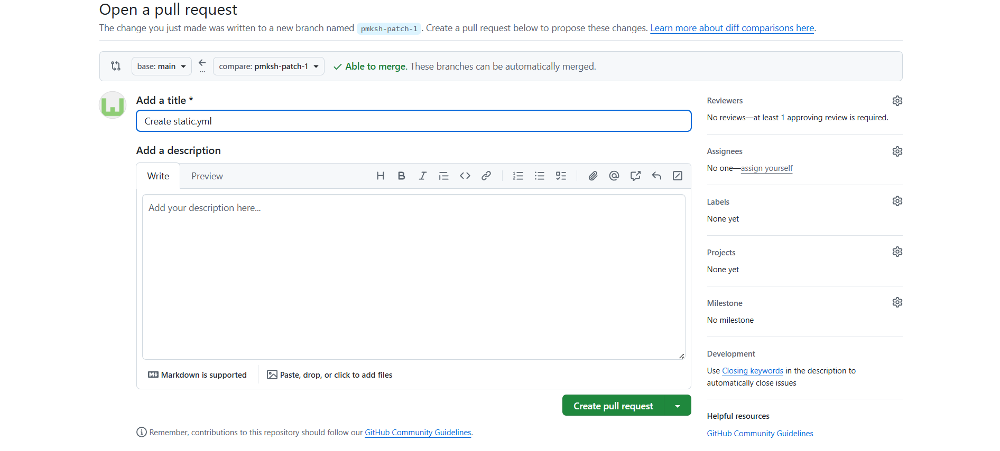

## Kanban Board and Project Progress