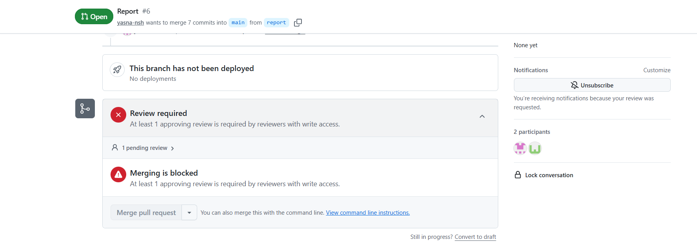
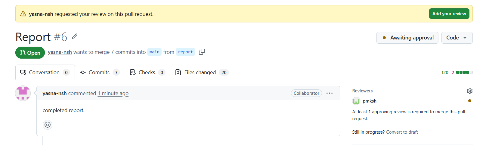
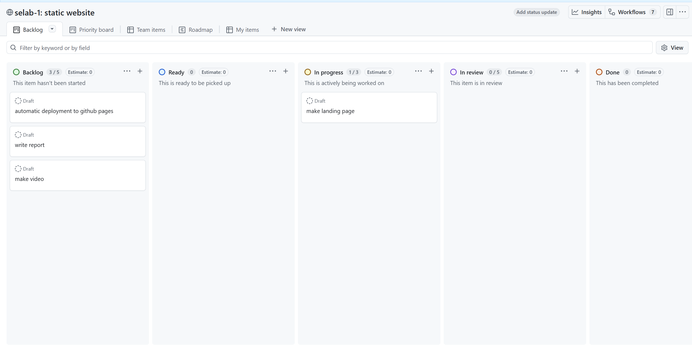
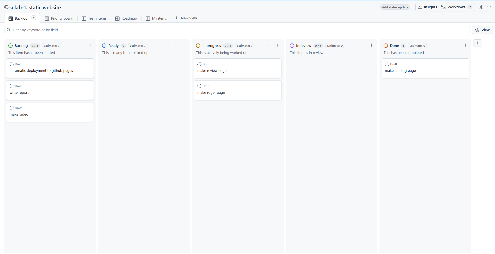
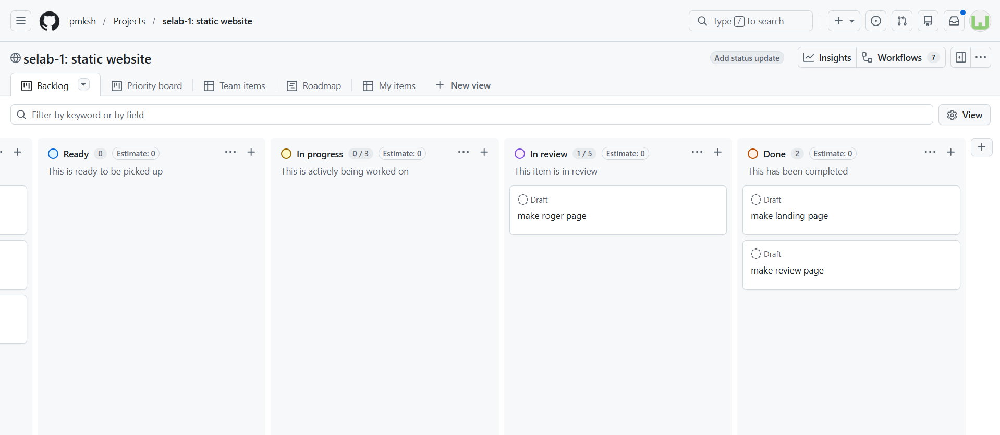

<h1 align="center">
  <br>
  SE Lab
  <br>
  <small>Assignment 1: Static Website</small>
</h1>

<p align="center">
  <b>Group 5</b>
  <br>
  Pouria Mahmoudkhan (401110289)
  <br>
  Yasna Noushiravani (401106674)
</p>

---
<p align="center">
  <a href="#overview">Overview</a> •
  <a href="#branches">Branches</a> •
  <a href="#conflicts">Conflicts</a> •
  <a href="#main-branch-protection">Main Branch Protection</a> •
  <a href="#github-pages-deployment">Github Pages Deployment</a> •
  <a href="#kanban-board-and-project-progress">Kanban Board and Project Progress</a>
</p>

## Overview
In this assignment we practiced essential skills needed to develop a project, including
1. Basic github commands
1. Merging branches
1. Resolving conflicts
1. Creating pull requests and reviewing them
1. Using github actions to automate Github Page deployment
1. Protecting a branch by only allowing changes via pull requests
1. Creating projects and kanban boards to record and manage progress

## Branches
This repository has 8 branches.
### Main branch
This is the main branch of our repository!

The final changes are merged into this branch. Therefore it is protected from unreviewed merges and pull requests are required to make changes to this branch.
### Feature branches
1. Index: This branch is related to the developement of the main page and was created quite early in the process. As the commits suggest, the files added to the project at this stage were
    - `index.html`: the HTML file for the landing page
    - `style.html`: the CSS file containing all of the styling used in the project
    - `images`: the folder containing the pictures used in the website

    
    After completing the developement of the main page, we merged this branch back into main using pull requests.
    

1. Review: In this branch we built the review tab. The changed files are
    - `review.html`: the HTML file for the review page, containing navbars and some reviews
    - `style.css`: this file was modified to contain the styles used by the review page

    
    This branch was developed in parallel with the roger branch.

1. Roger: This branch was used to make the Roger tab, containing
    - `roger.html`: the HTML file for the roger page
    - `style.css`: changes to the styles needed in this page
    - some images used in this page uploaded to the `images` folder

    The main branch was later merged into this branch to resolve the conflicts in `style.css`.
    
    Then a pull request was created to merge roger into main.
    

1. About-dev: The about section was added in this branch. Similar to the previous branches, `about.html` (the HTML file for this section) was created and `style.css` was modified.


### Hotfix Branch
This branch was created to fix the unresponsiveness of the webpage. Then it was merged into main with a pull request.


### pmksh-patch-1
In this branch the yaml file, required for Github Pages deployment with Github Actions, was created.


### Report Branch
Currently under development! This branch was created to add `.gitignore` and complete `README.md`. The changes currently commited to this branch are as follows.

## Conflicts

1. The first conflict occured while merging the index branch. The class field in the navbar wa not present in one side of the conflict and the order of the links were different. The conflict was resolved in favor of the commit where the class field was present.

as can be seen in the picture above.

2. The second conflict occured while merging the roger branch. We both had changed the css file in parallel. The conflict was resolved by accepting both changes. This resolution was done in github.

as can be seen in the picture above.

## Main Branch Protection

For this requirement we have set the rule to require a pull request before merging along with at least 1 approval from an admin.


The review of the pull request can be seen in the picture below. This was during the index merge with main.


Here is how it looks when a pull request review is submitted:





## Github Pages Deployment

Github pages was also created and deployed in github actions in the following url:
https://pmksh.github.io/selab-1/


Made using the static html option, it was merged into main after review.


## Kanban Board and Project Progress
To track progress and manage development, we created a project and organized the tasks in a kanban board. Some snapshots of the kanban board are as follows.
- Kanban board during the development of the landing page

- Kanban board during the development of review and roger pages

- Kanban board during testing roger



# Answers to Questions

## What is the `.git` folder? What information is stored in it? How is it created?

The `.git` folder is the core directory of a Git repository. It contains all the data and metadata required for version control and is usually located in the root directory of a project as a hidden folder.

Important information stored inside `.git` includes:

- Commit history
- Branch information
- Repository configuration
- Remote repository URLs
- Tags
- Git objects and snapshots
- Logs and references
- Staging area (index)

If the `.git` folder is deleted, the project will no longer be recognized as a Git repository, and all version history will be lost.

The `.git` folder is created using the following command:

```bash
git init
```

---

## What does “atomic” mean in atomic commit and atomic pull request?

Atomic means that a change should represent one complete and independent unit of work.

### Atomic Commit

An atomic commit:

- Contains only one logical change
- Avoids mixing unrelated modifications
- Makes debugging and reverting easier
- Improves readability of project history

Examples:

- One commit for fixing a bug
- One commit for adding a feature
- One commit for refactoring code

### Atomic Pull Request

An atomic pull request:

- Focuses on a single feature or issue
- Does not include unrelated changes
- Makes code review easier
- Reduces merge conflicts and confusion

---

## Difference between `fetch`, `pull`, `merge`, `rebase`, and `cherry-pick`

### `git fetch`

Downloads updates from the remote repository but does not modify the current working branch.

```bash
git fetch
```

Features:

- Retrieves new commits and references
- Does not merge changes automatically
- Safe for checking updates before integration

---

### `git pull`

Fetches updates from the remote repository and then merges them into the current branch.

```bash
git pull
```

Equivalent to:

```bash
git fetch
git merge
```

Features:

- Updates the local branch directly
- Combines fetching and merging in one command

---

### `git merge`

Combines changes from another branch into the current branch.

```bash
git merge branch-name
```

Features:

- Preserves branch history
- May create a merge commit
- Commonly used in collaborative workflows

---

### `git rebase`

Moves or reapplies commits from one branch onto another base commit.

```bash
git rebase main
```

Features:

- Produces a cleaner and linear history
- Rewrites commit history
- Often used before merging feature branches

---

### `git cherry-pick`

Applies a specific commit from another branch to the current branch.

```bash
git cherry-pick commit-hash
```

Features:

- Selectively copies commits
- Useful when only one change is needed
- Avoids merging an entire branch

---

## Difference between `reset`, `revert`, `restore`, `switch`, and `checkout`

### `git reset`

Moves the current branch pointer (HEAD) and can modify the staging area or working directory.

```bash
git reset HEAD~1
```

Common uses:

- Removing commits
- Unstaging files
- Rewriting local history

---

### `git revert`

Creates a new commit that reverses the effects of a previous commit.

```bash
git revert commit-id
```

Features:

- Safe for shared repositories
- Preserves project history
- Does not delete commits

---

### `git restore`

Restores files to a previous state.

```bash
git restore file.txt
```

Common uses:

- Discarding local changes
- Recovering files from commits or staging area

---

### `git switch`

Used for switching between branches.

```bash
git switch dev
```

Features:

- Modern alternative for branch switching
- Simpler and more focused than checkout

---

### `git checkout`

An older multi-purpose command used for:

- Switching branches
- Restoring files
- Navigating commits

```bash
git checkout branch-name
```

Features:

- Powerful but sometimes confusing
- Partially replaced by `switch` and `restore`

---

## What is the stage (index)? What does the `stash` command do?

### Stage / Index

The staging area (also called the index) is an intermediate area between the working directory and the repository history.

Workflow:

```text
Working Directory -> Staging Area (Index) -> Commit
```

When a file is added using:

```bash
git add file.txt
```

the file moves into the staging area and becomes ready for the next commit.

Purpose of staging:

- Selectively choose changes for commits
- Organize commits more cleanly
- Review changes before committing

---

### `git stash`

Temporarily saves uncommitted changes so the working directory becomes clean.

```bash
git stash
```

To restore the saved changes:

```bash
git stash pop
```

Common uses:

- Switching branches without committing unfinished work
- Saving temporary progress
- Cleaning the workspace quickly

---

## What does snapshot mean? What is its relationship with commits?

In Git, every commit represents a snapshot of the project at a specific moment in time.

Unlike some version control systems that store only file differences, Git stores a snapshot of the entire project state for each commit.

Features of snapshots:

- Capture the state of files at a specific time
- Allow restoring previous versions
- Form the basis of Git history

Relationship with commits:

- Each commit creates a new snapshot
- Commits are linked to previous snapshots
- Together they form the repository history

---

## Difference between local repository and remote repository

### Local Repository

A local repository exists on the developer’s own computer.

Features:

- Stores local commits and branches
- Works without internet access
- Main development usually happens here

Example:

```bash
git init
```

---

### Remote Repository

A remote repository is hosted on a server or platforms such as GitHub, GitLab, or Bitbucket.

Features:

- Used for collaboration
- Shared among team members
- Supports push and pull operations

Example of adding a remote repository:

```bash
git remote add origin <repository-url>
```

Common remote operations:

```bash
git push
git pull
git fetch
```